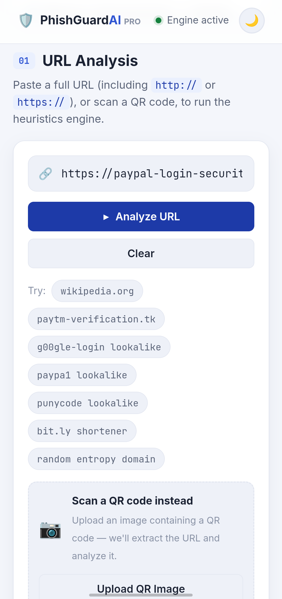
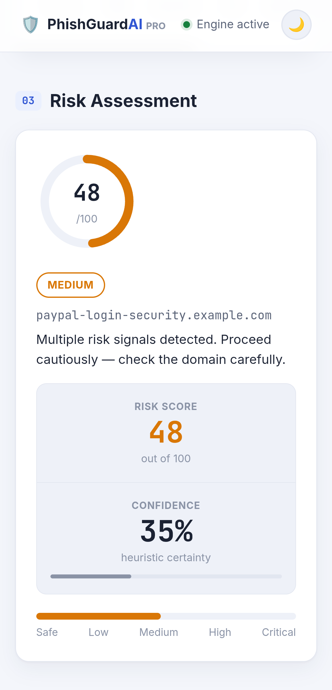
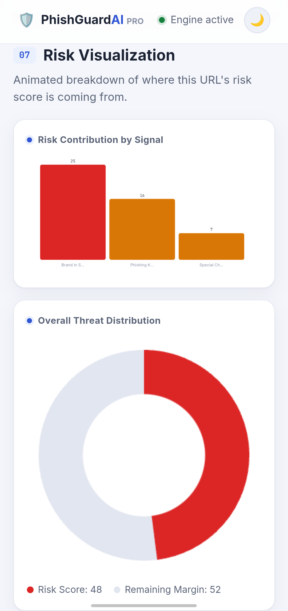

# 🛡️ PhishGuard AI Pro

## 📌 Overview
PhishGuard AI Pro is a cybersecurity-focused web application designed to help users identify suspicious and potentially phishing URLs. The project aims to improve online safety by providing quick URL analysis and security awareness.

## ✨ Features
- URL security analysis
- Phishing detection assistance
- User-friendly interface
- Fast and responsive design
- Browser-based access
- Cybersecurity awareness focus

## 🛠️ Technologies Used
- HTML5
- CSS3
- JavaScript

## 🚀 Live Demo
https://muthupriyan-dev.github.io/phishguard/Phishguard-AI-Pro.html

## 💻 How to Use
1. Open the live demo link.
2. Enter or paste a URL for analysis.
3. Review the security assessment.
4. Follow the provided security recommendations.

## 📷 Screenshots

## 🎯 Project Goals
This project was created to practice:
- Frontend web development
- Cybersecurity concepts
- User interface design
- JavaScript-based analysis tools

## 🔮 Future Improvements
- Real-time threat intelligence integration
- Advanced phishing detection techniques
- Browser extension support
- Security reports and export options
- Enhanced AI-powered analysis

## 👨‍💻 Author
**Muthupriyan**

GitHub: https://github.com/muthupriyan-dev

## 📄 License
This project is open source and available under the MIT License.
